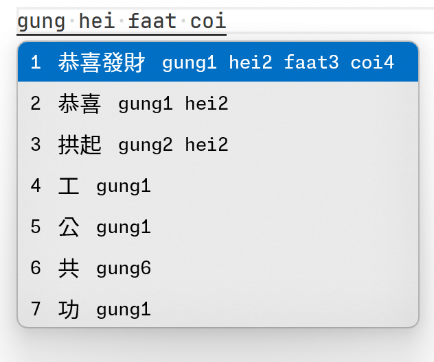

Jyutping
======

<a href="https://t.me/jyutping">
        
</a>
<a href="https://www.instagram.com/jyutping_app">
        
</a>
<a href="https://www.threads.net/@jyutping_app">
        
</a>
<a href="https://x.com/JyutpingApp">
        
</a>
<a href="https://jq.qq.com/?k=4PR17m3t">
        
</a>
<br>
<br>

Cantonese input method for Windows using Text Services Framework (TSF).

See also:
- [iOS and macOS](https://github.com/yuetyam/jyutping)
- [Android](https://github.com/yuetyam/jyutping-android)
- [HarmonyOS](https://github.com/yuetyam/jyutping-harmony)

## Screenshots
<a href="https://jyutping.app">
        
</a>

## Download and install
Please visit our website: https://jyutping.app

## How to build

Requirements:

- Windows 11
- Visual Studio 2026 with the C++ desktop toolchain and the Windows 11 SDK
- `Jyutping\Resources\ime.sqlite3` (You can download from [here](https://github.com/yuetyam/jyutping-windows/releases/download/0.1.0/ime.sqlite3) )

Build from the repository root:

```powershell
msbuild Jyutping.sln /p:Configuration=Debug /p:Platform=x64
msbuild Jyutping.sln /p:Configuration=Release /p:Platform=x64
msbuild Jyutping.sln /p:Configuration=Debug /p:Platform=Win32
msbuild Jyutping.sln /p:Configuration=Release /p:Platform=Win32
msbuild Jyutping.sln /p:Configuration=Debug /p:Platform=ARM64
msbuild Jyutping.sln /p:Configuration=Release /p:Platform=ARM64
msbuild Jyutping.sln /p:Configuration=Debug /p:Platform=ARM64EC
msbuild Jyutping.sln /p:Configuration=Release /p:Platform=ARM64EC
```

The build copies `Jyutping\Resources\ime.sqlite3` beside each built `Jyutping.dll`.

## Packaging

Requirements:

- Release payloads for `x64`, `Win32`, and `ARM64EC`
- Inno Setup 7

Create both installer EXEs from the repository root:

```powershell
pwsh -File installer\Build-Installers.ps1
```

The script builds the required Release configurations, stages the installer
payloads under `installer\stage`, runs Inno Setup, and writes release artifacts
under `installer\output`:

```text
installer\output\jyutping-v0.2.0-x64.exe
installer\output\jyutping-v0.2.0-arm64.exe
installer\output\SHA256SUMS.txt
```

The x64 installer contains x64 and x86 DLL payloads.

The ARM64 installer uses the `ARM64EC\Release\Jyutping.dll` ARM64X root DLL and does not install an x86 fallback.

Uninstall is handled by Inno Setup's generated `unins000.exe` and the Windows Apps & Features uninstall entry.

## Credits
- [Rime-Cantonese](https://github.com/rime/rime-cantonese) (Cantonese Lexicon)
- [OpenCC](https://github.com/BYVoid/OpenCC) (Traditional-Simplified Character Conversion)
- [JetBrains](https://www.jetbrains.com/) (Licenses for Open Source Development)

## Support this project
Website: https://jyutping.app/donate

愛發電: https://afdian.com/a/jyutping

Ko-fi: https://ko-fi.com/zheung

Patreon: https://patreon.com/bingzheung

PayPal: https://paypal.me/bingzheung

Bitcoin: `bc1qx5tjmlvq8ydmfzxt5fru7vqq0khjkhf2savheh`


